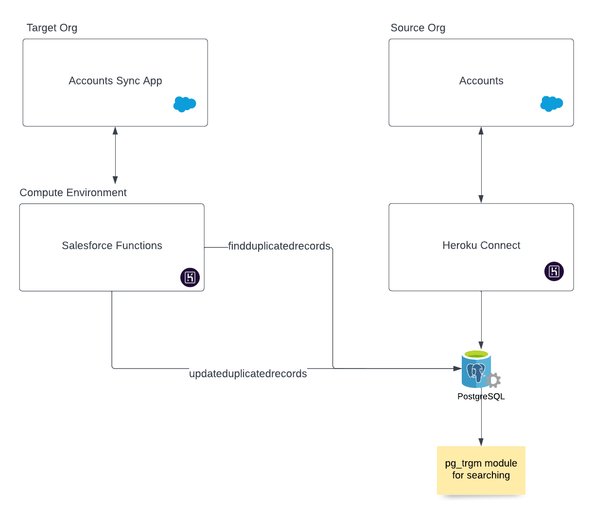

# Accounts Sync App

## Description

Update accounts in a target org with data from a source org. The application uses Salesforce functions and the `pg_trgm` module in Postgres to find duplicated records.

## Architecture



## Installation

1. Log in and set up your Devhub, the org must have Salesforce functions enabled.

```
sfdx auth:web:login -d -a <alias>
```

#### Configure Source Org:

1. Create the source scratch org

```
sfdx force:org:create -s -f config/project-scratch-def.json -a sourceorg
```

2. Push source code to org

```
sfdx force:source:push -f
```

3. Import Accounts

```
sfdx force:data:bulk:upsert -i Id -f data/Source.csv -s Account
```

4. Create a Heroku app for data resources

```
heroku create <app-name>
```

5. Create Postgres resource

```
heroku addons:create heroku-postgresql:hobby-dev -a <app-name>
```

6. Create Heroku Connect resource

```
heroku addons:create herokuconnect:demo -a <app-name>
```

7. Configure Heroku Connect

Follow [documentation](https://devcenter.heroku.com/articles/quick-start-heroku-connect) from step 4 to configure Heroku connect; use `salesforce` as the schema(it's the default) and map all the standard fields for the Account Object.

#### Configure Target Org:

1. Create the target scratch org

```
sfdx force:org:create -s -f config/project-scratch-def.json -a targetorg
```

2. Push source code to org

```
sfdx force:source:push -f
```

3. Import Accounts

```
sfdx force:data:bulk:upsert -i Id -f data/Target.csv -s Account
```

4. Assign Permission Sets

```
sfdx force:user:permset:assign -n Accounts_Sync_App
sfdx force:user:permset:assign -n Functions
```

5. Create Compute Environment

```
sf login functions
sf env create compute --connected-org=targetorg --alias=accountssyncenv
```

6. Log in to DevHub if you have not already, then Deploy Functions

```
sf login functions
sf deploy functions -o targetorg
```

7. Add Heroku User Collaborator to Functions Account

```
sf env compute collaborator add --heroku-user <user_email_of_your_heroku_account>
```

8. Attach Postgres Database to Compute Environment

```
heroku addons:attach <postgresql_database_name> -a <compute_environment_name>
```

9. Install pg_trgm Module in Postgresql

```
cd scripts
npm install
heroku config --shell -a <app-name> > .env
node create-extension.js
```

## Usage

Go to your target scratch org and open the `Accounts Sync` application

## Reset Data in the source and target org

To reset the data for the target and source orgs run the following command:

```
node scripts/reset-orgs.js
```

This will prompt for both Target and Source Org users as well as a Database URL. The script will then delete all Accounts in both org and upsert the [source data](./data/Source.csv) and the [target data](./data/Target.csv) respectivelly.
If you do not want to reset a specific org, do not enter the user for that org.
